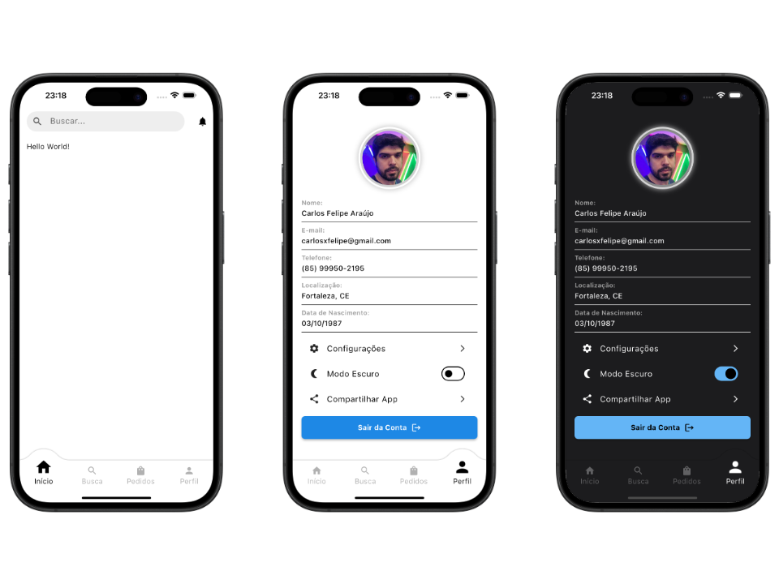

# Flutter Route Template

<p align="center">
  
</p>

Este projeto é um template para aplicações Flutter, utilizando `go_router` para navegação e outras bibliotecas essenciais para o desenvolvimento.

## 📦 Instalação

1. **Clone o repositório:**

   ```sh
   git clone https://github.com/carlosxfelipe/flutter-route-template.git
   cd flutter-route-template
   ```

2. **Instale as dependências:**

   ```sh
   flutter pub get
   ```

3. **Crie a estrutura de diretórios necessária:**

   Certifique-se de que a pasta de assets existe antes de rodar o projeto. Caso contrário, crie-a manualmente:

   ```sh
   mkdir -p assets/photos/
   ```

## 🚀 Execução do Projeto

Para rodar o projeto em um emulador ou dispositivo:

```sh
flutter run
```

Se precisar rodar em uma plataforma específica:

```sh
flutter run -d <plataforma>
```

Substitua `<plataforma>` por `android`, `ios`, `web`, `linux`, `windows` ou `macos`.

## 🧩 Template

Se você deseja utilizar este template em seu próprio projeto Flutter, siga os passos abaixo:

1. **Copie os arquivos da pasta `lib/` para o seu projeto.**

   - Isso inclui todas as telas, widgets e configurações de navegação.

2. **Instale as dependências utilizadas no template:**
   Execute o seguinte comando no terminal dentro do diretório do seu projeto para adicionar as bibliotecas necessárias:

   ```sh
   flutter pub add convex_bottom_bar go_router provider
   ```

3. **Ajuste os imports no seu projeto:**

   Como este template foi desenvolvido com um namespace específico (`flutter_route_template`), você precisará ajustar os imports em seus arquivos para refletir o nome do seu próprio projeto. Por exemplo, substitua:

   ```dart
   import 'package:flutter_route_template/widgets.dart';
   ```

   por:

   ```dart
   import 'package:seu_projeto/widgets.dart';
   ```

## ℹ️ Observação

O template oferece dois widgets de barra de navegação para escolher:

- **CustomBottomNavigationBar**: não possui dependências externas.
- **CustomConvexBottomBar**: utiliza a dependência `convex_bottom_bar`.

## 📂 Estrutura do Projeto

```
flutter-route-template/
├── README.md
├── pubspec.yaml
├── lib/
│   ├── main.dart
│   ├── screens.dart
│   ├── widgets.dart
│   ├── routes/
│   │   └── router.dart
│   ├── screens/
│   │   ├── home_screen.dart
│   │   └── profile_screen.dart
│   ├── theme/
│   │   ├── theme.dart
│   │   └── theme_provider.dart
│   └── widgets/
│       ├── custom_app_bar.dart
│       ├── custom_bottom_navigation_bar.dart
│       └── custom_convex_bottom_bar.dart
├── assets/
│   ├── LICENSE.md
│   └── photos/
├── android/
├── ios/
├── linux/
├── macos/
├── web/
└── windows/
```

## 🛠 Tecnologias Utilizadas

- **Flutter** - Framework para desenvolvimento multiplataforma
- **go_router** - Gerenciamento de rotas
- **provider** - Gerenciamento de estado
- **convex_bottom_bar** - Barra de navegação customizável

## 📜 Licença

Este projeto está sob a licença MIT.
